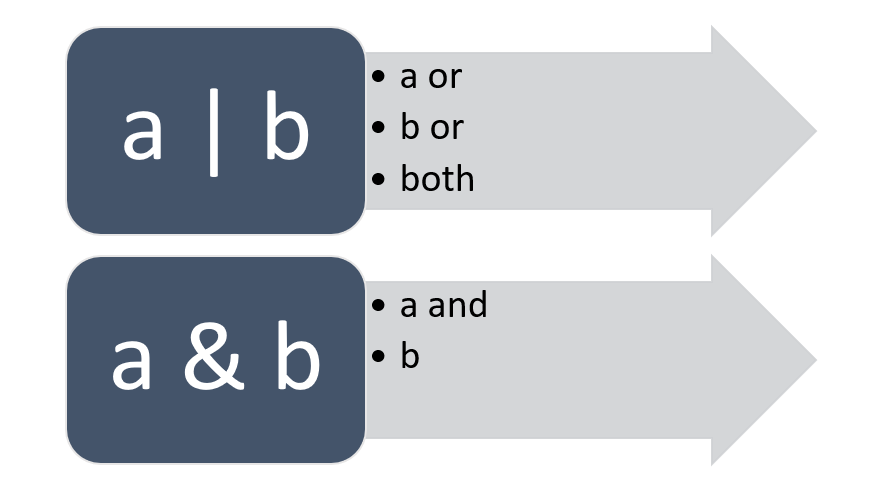

# The significance of union and intersection types in Typescript.



TypeScript making out code more reliable and easy to read.
And it is very important to use types in your code. Union and intersection types are very important in Typescript.These types are very powerful tools that help us to define out variable types safe and more flexible.

Remember that In math, Set theory provides us with the concept of union and intersection. A union includes all unqiue items from two or more sets. And an intersection includes all items that are common to all sets.

In TypeScript, union and intersection types are used to compose or model types from existing types.These new composed types behave differently, depending on whether they were composed through a union or intersection of the existing type they were formed from.

### Why Use Union and Intersection Types?

In JavaScript, a variable can hold any type of value, like a number, a string, or something else. This can sometimes cause errors if we accidentally use the wrong type. TypeScript helps by allowing us decide what type each variable should be, like "only a number" or "only a string." Union and intersection types give us even more control by allowing us choose multiple types for a variable or combine types when needed. This makes our code safer and helps us catch mistakes early.

### Union Types

A union type is like giving a variable multiple options. Imagine you’re filling out a form that asks you for either your phone number or your email address. This is similar to how union types work. We use a union type when we want a variable to accept more than one type. The pipe `|` symbol is used to join multiple types to form union types. For example:

```ts
let contactInfo: string | number;
contactInfo = "one@one.com";
contactInfo = 01700000000;
```

If we try to assign any other type like `object` or `boolean`, typescript will give us an error. This feature is userfull when we want to accept more than one type.

### Intersection Types

Intersection types are giving us the ability to combine multiple types into one. Imagine, we have One object PersonalInfo and another object ContactInfo. We want to combine these two types into one. The new type require all the properties from both types. it’s made up of various types joined together by an `&` symbol. For example:

```ts
type PersonalInfo = {
  name: string;
  age: number;
};

type ContactInfo = {
  email: string;
  phone: number;
};

type Person = PersonalInfo & ContactInfo;

const jamal: Person = {
  name: "Jamal",
  age: 23,
  email: "jamal@one.com",
  phone: 01700000000,
};
```

So, `jamal` mush have all the properties of `PersonalInfo` and `ContactInfo`. If we forget any of these, Typescript will give us an error.

### When to Use Union and Intersection Types?

- Use `union` types when you want a variable to have multiple types. For example: if a variable cab be a `string` or a `number`.

- Use `intersection` types when you want a variable to combine multiple types. This is especially useful when defining complex objects with multiple required fields.

### Conclusion

This is good practice to use union and intersection types in Typescript. We can combine multiple object into one with an intersection type and we can combine multiple types into one with a union type. These tools can help you write code that’s easier to read, maintain, and debug, making them essential for any TypeScript developer.
